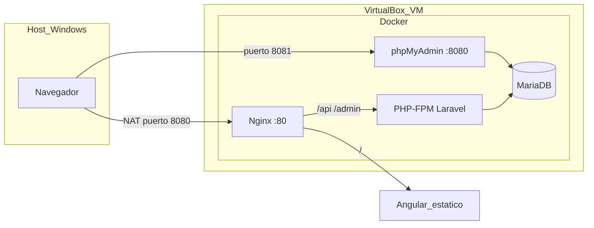

# Guía paso a paso — Máquina virtual (VirtualBox) + despliegue Docker

> **Proyecto:** PitStop Manager  
> **Objetivo:** Crear una VM con Ubuntu, desplegar la aplicación con Docker Compose y documentar el proceso con **capturas de pantalla** para la memoria del TFG.  
> **Tiempo estimado:** 2–4 horas la primera vez.

---

## Índice de capturas (checklist para la memoria)

Marca cada captura cuando la tengas. El número coincide con los pasos del documento.

| # | Qué capturar |
|---|----------------|
| 1 | VirtualBox Manager con la VM creada (vacía, antes de instalar SO) |
| 2 | Asistente de creación: nombre, tipo Linux, Ubuntu 64-bit |
| 3 | Asignación de RAM (2048–4096 MB) y disco (25–40 GB dinámico) |
| 4 | Configuración de red: Adaptador 1 en **NAT** + reenvío de puertos |
| 5 | Montaje del ISO de Ubuntu Server/Desktop |
| 6 | Instalación de Ubuntu: idioma y teclado |
| 7 | Instalación de Ubuntu: usuario y contraseña |
| 8 | Instalación completada — login en consola o escritorio |
| 9 | Terminal: `ip a` o IP de la VM (opcional si usas reenvío de puertos) |
| 10 | `docker --version` y `docker compose version` |
| 11 | Proyecto clonado/copiado en `~/PitStopManager` (`ls` del directorio) |
| 12 | `npm run build` del frontend terminado correctamente |
| 13 | Archivo `backend/.env` editado (oculta contraseñas sensibles si publicas) |
| 14 | `docker compose up -d --build` — contenedores en estado **running** |
| 15 | `docker compose ps` mostrando nginx, php, db, phpmyadmin |
| 16 | `php artisan migrate --seed` ejecutado sin errores |
| 17 | Navegador: página principal `http://localhost` (o IP de la VM) |
| 18 | Navegador: login piloto y panel (`piloto1@pitstop.com`) |
| 19 | Navegador: admin `http://localhost/admin/login` |
| 20 | (Opcional) phpMyAdmin en `http://localhost:8080` |

---

## Parte A — Requisitos en tu PC (host Windows)

### A.1 Software a instalar en Windows

| Software | Para qué | Enlace |
|----------|----------|--------|
| **VirtualBox** | Crear la VM | https://www.virtualbox.org/wiki/Downloads |
| **Ubuntu ISO** | Sistema operativo de la VM | https://ubuntu.com/download (22.04 o 24.04 LTS) |
| **WinSCP** o similar (opcional) | Copiar el proyecto a la VM | https://winscp.net |

📸 **Captura 1 (opcional):** instaladores descargados o carpeta del proyecto en Windows.

### A.2 Tamaño del proyecto a llevar a la VM

Necesitas la carpeta completa `PitStopManager` **excepto**:

- `frontend/node_modules` (se reinstala en la VM)
- `backend/vendor` (se genera con Composer en la VM)
- `backend/.env` (creas uno nuevo en la VM a partir de `.env.example`)

Puedes comprimir el proyecto en ZIP o usar `git clone` si el repo está en GitHub.

---

## Parte B — Crear la máquina virtual en VirtualBox

### Paso B.1 — Nueva máquina virtual

1. Abre **Oracle VM VirtualBox Manager**.
2. Clic en **Nueva** (o Machine → New).

📸 **Captura 2:** ventana «Crear máquina virtual» con:
- **Nombre:** `PitStop-Manager-VM`
- **Carpeta:** (por defecto)
- **Imagen ISO:** selecciona el `.iso` de Ubuntu descargado
- **Tipo:** Linux
- **Subtipo:** Ubuntu (64-bit)

3. Siguiente.

### Paso B.2 — Memoria (RAM)

- Asigna **4096 MB** (4 GB) si tu PC tiene ≥ 8 GB RAM; si no, **2048 MB** mínimo.

📸 **Captura 3:** pantalla de memoria base.

### Paso B.3 — Disco duro

- **Crear un disco duro virtual ahora**
- Tipo: **VDI**
- Almacenamiento: **Reservado dinámicamente**
- Tamaño: **30–40 GB**

📸 **Captura 3 (continuación):** tamaño del disco.

4. Finalizar. La VM aparece en la lista apagada.

📸 **Captura 1:** VirtualBox con `PitStop-Manager-VM` en la lista.

### Paso B.4 — Reenvío de puertos (acceder desde Windows sin IP bridged)

Así podrás abrir la app en el navegador de Windows con `http://localhost`.

1. Selecciona la VM → **Configuración** → **Red**.
2. **Adaptador 1:** activado, conectado a **NAT**.
3. Clic en **Reenvío de puertos** → añade:

| Nombre | Protocolo | IP anfitrión | Puerto anfitrión | IP invitado | Puerto invitado |
|--------|-----------|---------------|------------------|-------------|-----------------|
| http | TCP | 127.0.0.1 | 8080 | | 80 |
| mysql | TCP | 127.0.0.1 | 3307 | | 3306 |
| pma | TCP | 127.0.0.1 | 8081 | | 8080 |

> **Nota:** El puerto 8080 en Windows lo usamos para la **app web** (nginx en la VM usa el 80). phpMyAdmin quedará en `http://localhost:8081`.

📸 **Captura 4:** tabla de reenvío de puertos.

**Alternativa (más simple para memoria):** Adaptador 1 en **Adaptador puente** (Bridged) → accedes con `http://IP_DE_LA_VM` sin reenvío.

### Paso B.5 — Arrancar e instalar Ubuntu

1. Inicia la VM (doble clic → **Iniciar**).
2. Sigue el instalador de Ubuntu:
   - Idioma español
   - Teclado español
   - Instalación normal / borrar disco y usar todo (dentro de la VM)
   - Usuario: por ejemplo `pitstop` / contraseña que recuerdes
   - Instalar OpenSSH server (recomendado): marca la casilla si aparece

📸 **Capturas 5, 6, 7:** instalador Ubuntu (ISO, partición, usuario).

3. Reinicia cuando pida. Si queda el ISO montado: **Dispositivos → Unidades ópticas → Quitar disco**.

📸 **Captura 8:** pantalla de login de Ubuntu (escritorio o consola).

---

## Parte C — Preparar Ubuntu dentro de la VM

### Paso C.1 — Actualizar el sistema

Abre **Terminal** en la VM:

```bash
sudo apt update && sudo apt upgrade -y
```

📸 **Captura 9 (opcional):** terminal con `ip a` mostrando la IP (útil si usas modo puente).

### Paso C.2 — Instalar Git

```bash
sudo apt install -y git curl
```

### Paso C.3 — Instalar Docker y Docker Compose

```bash
# Paquetes oficiales Docker (Ubuntu)
sudo apt install -y ca-certificates curl gnupg
sudo install -m 0755 -d /etc/apt/keyrings
curl -fsSL https://download.docker.com/linux/ubuntu/gpg | sudo gpg --dearmor -o /etc/apt/keyrings/docker.gpg
sudo chmod a+r /etc/apt/keyrings/docker.gpg

echo "deb [arch=$(dpkg --print-architecture) signed-by=/etc/apt/keyrings/docker.gpg] https://download.docker.com/linux/ubuntu $(. /etc/os-release && echo "$VERSION_CODENAME") stable" | sudo tee /etc/apt/sources.list.d/docker.list > /dev/null

sudo apt update
sudo apt install -y docker-ce docker-ce-cli containerd.io docker-buildx-plugin docker-compose-plugin

# Tu usuario puede usar docker sin sudo
sudo usermod -aG docker $USER
```

Cierra sesión y vuelve a entrar (o reinicia la VM) para que el grupo `docker` aplique.

Comprueba:

```bash
docker --version
docker compose version
```

📸 **Captura 10:** versiones de Docker y Docker Compose.

### Paso C.4 — Instalar Node.js (para compilar Angular)

```bash
curl -fsSL https://deb.nodesource.com/setup_20.x | sudo -E bash -
sudo apt install -y nodejs
node -v
npm -v
```

---

## Parte D — Copiar el proyecto a la VM

### Opción 1 — Git (si tienes repositorio remoto)

```bash
cd ~
git clone TU_URL_REPOSITORIO PitStopManager
cd PitStopManager
```

### Opción 2 — WinSCP desde Windows

1. En la VM: `sudo apt install -y openssh-server` (si no está).
2. IP de la VM: `ip a` → ejemplo `192.168.1.50`.
3. En WinSCP (Windows): conectar SFTP `pitstop@192.168.1.50`, copiar carpeta `PitStopManager` a `/home/pitstop/`.

📸 **Captura 11:** terminal con `ls ~/PitStopManager` mostrando `backend`, `frontend`, `docker-compose.yml`.

---

## Parte E — Configurar y compilar antes de Docker

### Paso E.1 — Build del frontend Angular

```bash
cd ~/PitStopManager/frontend
npm ci
npm run build
```

Debe existir la carpeta:

```bash
ls ../frontend/dist/frontend/browser/index.html
```

📸 **Captura 12:** terminal con `Application bundle generation complete` o listado de `dist/frontend/browser`.

### Paso E.2 — Archivo `.env` de Laravel para Docker

```bash
cd ~/PitStopManager/backend
cp .env.example .env
nano .env
```

Ajusta **como mínimo** estas líneas (valores para `docker-compose.yml` del proyecto):

```env
APP_NAME=PitStopManager
APP_ENV=production
APP_DEBUG=false
APP_URL=http://localhost
FRONTEND_URL=http://localhost

DB_CONNECTION=mysql
DB_HOST=db
DB_PORT=3306
DB_DATABASE=pitstop_manager
DB_USERNAME=pitstop
DB_PASSWORD=pitstop

SESSION_DRIVER=cookie
SESSION_DOMAIN=localhost

SANCTUM_STATEFUL_DOMAINS=localhost

# Opcional — Stripe / correo (puedes dejar vacío para la demo)
STRIPE_KEY=
STRIPE_SECRET=
STRIPE_WEBHOOK_SECRET=

MAIL_MAILER=log
```

Guarda: `Ctrl+O`, Enter, `Ctrl+X`.

📸 **Captura 13:** editor nano con `.env` (tapa `DB_PASSWORD` si la memoria es pública).

> Si usas **modo puente** y accedes por IP `http://192.168.x.x`, cambia `APP_URL`, `FRONTEND_URL` y `SANCTUM_STATEFUL_DOMAINS` a esa IP.

---

## Parte F — Levantar Docker Compose

### Paso F.1 — Construir y arrancar contenedores

Desde la raíz del proyecto:

```bash
cd ~/PitStopManager
docker compose up -d --build
```

Servicios definidos en `docker-compose.yml`:

| Contenedor | Función | Puerto en la VM |
|------------|---------|-----------------|
| nginx | Sirve Angular + proxy API/admin | 80 |
| php | PHP-FPM + Laravel | interno |
| db | MariaDB | 3306 (3307 en host si reenvías) |
| phpmyadmin | Administrar BD | 8080 |

📸 **Captura 14:** terminal con `Container ... Started` sin errores.

```bash
docker compose ps
```

📸 **Captura 15:** los 4 servicios en estado **running**.

### Paso F.2 — Composer y Laravel dentro del contenedor PHP

El contenedor `php` monta `./backend`. Ejecuta como root para permisos:

```bash
docker compose exec -u root php composer install --no-dev --optimize-autoloader
docker compose exec -u root php php artisan key:generate --force
docker compose exec -u root php php artisan migrate --seed --force
docker compose exec -u root php php artisan storage:link
docker compose exec -u root php chown -R www:www /var/www/html/storage /var/www/html/bootstrap/cache
```

📸 **Captura 16:** salida de `migrate --seed` con seeders en verde / DONE.

---

## Parte G — Probar la aplicación

### Paso G.1 — Desde Windows (con reenvío de puertos)

| URL en el navegador de Windows | Qué es |
|--------------------------------|--------|
| http://localhost:8080 | App pública (Angular + API) |
| http://localhost:8080/admin/login | Panel administrador Blade |
| http://localhost:8081 | phpMyAdmin |

> Si configuraste reenvío puerto 80→80, usa `http://localhost` en lugar de `:8080`.

### Paso G.2 — Desde la propia VM (modo puente o terminal con curl)

```bash
curl -I http://localhost
```

### Paso G.3 — Usuarios de prueba

| Email | Contraseña | Rol |
|-------|------------|-----|
| admin@pitstop.com | password | Admin |
| carlos@pitstop.com | password | Organizador |
| piloto1@pitstop.com | password | Piloto |

📸 **Captura 17:** landing de PitStop Manager en el navegador.  
📸 **Captura 18:** panel piloto tras login.  
📸 **Captura 19:** login del panel admin.  
📸 **Captura 20 (opcional):** phpMyAdmin con base `pitstop_manager`.

---

## Parte H — Comandos útiles de mantenimiento

```bash
cd ~/PitStopManager

# Ver logs
docker compose logs -f nginx
docker compose logs -f php

# Parar / arrancar
docker compose down
docker compose up -d

# Tras cambiar código backend
docker compose exec -u root php php artisan config:clear
docker compose exec -u root php php artisan cache:clear

# Tras cambiar frontend
cd frontend && npm run build && cd ..
docker compose restart nginx

# Tareas programadas (suscripciones, emails carrera) — en producción real
docker compose exec -u root php php artisan schedule:work
```

---

## Parte I — Problemas frecuentes

| Problema | Solución |
|----------|----------|
| Página en blanco en `/` | Falta build: `cd frontend && npm run build` |
| Error 500 en `/api` | Revisa `docker compose logs php`, `.env` con `DB_HOST=db`, ejecuta `key:generate` y `migrate` |
| `Permission denied` en storage | `chown -R www:www storage bootstrap/cache` dentro del contenedor |
| No conecta desde Windows | Revisa reenvío de puertos o usa IP bridged + `http://IP_VM` |
| `docker: permission denied` | `sudo usermod -aG docker $USER` y vuelve a iniciar sesión |
| phpMyAdmin no entra | Usuario `root`, contraseña `secret` (según `docker-compose.yml`) |
| Stripe en la VM | Misma guía que `SETUP.md` §5; en producción usa IP/dominio público + ngrok o webhook en Dashboard |

---

## Parte J — Texto sugerido para la memoria (apartado «Despliegue»)

Puedes pegar y adaptar:

> El despliegue de PitStop Manager se realizó en una máquina virtual Ubuntu 22.04 LTS creada con Oracle VirtualBox, siguiendo el procedimiento documentado en `GUIA_VM_DOCKER_DESPLIEGUE.md`. La aplicación se containerizó con Docker Compose, definiendo cuatro servicios: Nginx como reverse proxy y servidor de archivos estáticos del frontend Angular, PHP-FPM 8.2 con Laravel 12, MariaDB 10.11 y phpMyAdmin para administración de la base de datos. El frontend se compiló en modo producción (`ng build`) con `apiUrl: '/api'`, de modo que el cliente y la API comparten el mismo origen. La Figura X muestra la creación de la VM, la Figura Y el estado de los contenedores (`docker compose ps`) y la Figura Z la aplicación accesible desde el navegador del host mediante reenvío de puertos NAT.

---

## Parte K — Diagrama para la memoria (opcional)



---

## Resumen rápido (orden de comandos)

```bash
# En la VM, después de instalar Docker y Node:
cd ~/PitStopManager/frontend && npm ci && npm run build
cd ../backend && cp .env.example .env && nano .env
cd .. && docker compose up -d --build
docker compose exec -u root php composer install --no-dev --optimize-autoloader
docker compose exec -u root php php artisan key:generate --force
docker compose exec -u root php php artisan migrate --seed --force
docker compose exec -u root php php artisan storage:link
```

Abre en Windows: **http://localhost:8080** (con el reenvío de puertos de la captura 4).

---

*Documento asociado al proyecto PitStop Manager — despliegue en VM con VirtualBox y Docker.*
