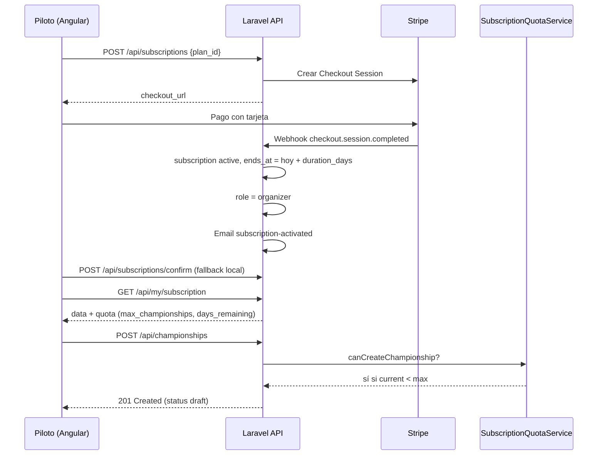

# PitStop Manager — Memoria técnica, despliegue y guía para IA

> **Propósito de este documento:** servir como fuente única y exhaustiva para (1) redactar la **memoria final** del proyecto (TFM/TFG/Proyecto Fin de Ciclo), (2) **desplegar** la aplicación en una máquina virtual o servidor, y (3) dar **contexto completo** a un asistente de IA sin tener que explorar todo el repositorio.
>
> **Última actualización:** mayo 2026 · **Tests:** 18 passed · **Build Angular:** OK

---

## Tabla de contenidos

1. [Resumen del proyecto](#1-resumen-del-proyecto)
2. [Objetivos sugeridos para la memoria académica](#2-objetivos-sugeridos-para-la-memoria-académica)
3. [Stack tecnológico](#3-stack-tecnológico)
4. [Arquitectura del sistema](#4-arquitectura-del-sistema)
5. [Modelo de datos](#5-modelo-de-datos)
6. [Roles, permisos y autenticación](#6-roles-permisos-y-autenticación)
7. [Sistema de suscripciones (reglas de negocio)](#7-sistema-de-suscripciones-reglas-de-negocio)
8. [Stripe — qué debes configurar](#8-stripe--qué-debes-configurar)
9. [Correos transaccionales y tareas programadas](#9-correos-transaccionales-y-tareas-programadas)
10. [API REST — referencia rápida](#10-api-rest--referencia-rápida)
11. [Frontend Angular](#11-frontend-angular)
12. [Panel de administración (Blade)](#12-panel-de-administración-blade)
13. [Pruebas automatizadas](#13-pruebas-automatizadas)
14. [Despliegue en máquina virtual (Ubuntu)](#14-despliegue-en-máquina-virtual-ubuntu)
15. [Despliegue con Docker](#15-despliegue-con-docker)
16. [Variables de entorno en producción](#16-variables-de-entorno-en-producción)
17. [Checklist antes de producción](#17-checklist-antes-de-producción)
18. [Prompts listos para IA (memoria final)](#18-prompts-listos-para-ia-memoria-final)
19. [Glosario](#19-glosario)
20. [Documentos relacionados en el repo](#20-documentos-relacionados-en-el-repo)

---

## 1. Resumen del proyecto

**PitStop Manager** es una plataforma web para la gestión de **campeonatos de karting amateur**. Permite:

| Actor | Capacidades principales |
|-------|-------------------------|
| **Piloto** | Registrarse, explorar campeonatos públicos, inscribirse en campeonatos/carreras, ver resultados, pagar suscripción para convertirse en organizador |
| **Organizador** | Crear circuitos, campeonatos y carreras; gestionar inscripciones; publicar resultados (requiere **suscripción activa** con límites de plan) |
| **Administrador** | Panel Blade en Laravel: usuarios, categorías, planes, suscripciones, pagos, campeonatos globales |

### Estructura del repositorio

```
PitStopManager/
├── backend/          # Laravel 12 API + admin Blade
├── frontend/         # Angular 21 SPA
├── docker/           # Nginx + PHP-FPM para producción
├── docker-compose.yml
├── SETUP.md          # Guía rápida local (Windows/XAMPP)
├── PROJECT_GUIDE.md  # Arquitectura y navegación del código
├── MEMORIA_Y_DESPLIEGUE.md  # ← este archivo
└── reference/Stride365/   # Proyecto de referencia (NO es PitStop)
```

### URLs en desarrollo

| Servicio | URL |
|----------|-----|
| App pública (Angular) | http://localhost:4200 |
| API + Admin Laravel | http://localhost:8000 |
| Admin login | http://localhost:8000/admin/login |

---

## 2. Objetivos sugeridos para la memoria académica

Puedes estructurar la memoria en capítulos estándar usando estos bloques (pide a la IA que desarrolle cada uno con 2–4 páginas):

### 2.1 Introducción
- Problema: gestión manual de campeonatos de karting (inscripciones, resultados, pagos).
- Solución propuesta: plataforma centralizada multi-rol con monetización por suscripción.
- Alcance: MVP funcional con pagos Stripe, no app móvil nativa.

### 2.2 Objetivos
- **General:** diseñar e implementar un sistema web para organizar campeonatos de karting.
- **Específicos (ejemplos):**
  - Autenticación segura con tokens (Sanctum).
  - Flujo de inscripción de pilotos con validación de categoría/edad.
  - Integración de pagos para planes de organizador.
  - Límites por plan (`max_championships`, `duration_days`).
  - Panel administrativo y API REST documentada.

### 2.3 Estado del arte / marco teórico
- Aplicaciones deportivas de gestión de ligas.
- APIs REST y SPAs (separación frontend/backend).
- Pasarelas de pago (Stripe Checkout vs suscripciones recurrentes de Stripe Billing).
- **Decisión del proyecto:** pago único por periodo (`mode: payment`), no renovación automática Stripe — la renovación es manual (nuevo checkout).

### 2.4 Análisis y diseño
- Diagramas: casos de uso (piloto, organizador, admin), diagrama ER, secuencia pago Stripe, arquitectura en capas.
- Referencia: sección [4](#4-arquitectura-del-sistema) y [5](#5-modelo-de-datos) de este documento.

### 2.5 Implementación
- Backend Laravel: controladores, políticas, servicios (`StripeService`, `SubscriptionQuotaService`).
- Frontend Angular: guards, interceptores, componentes por rol.
- Seguridad: middleware `auth:sanctum`, `EnsureUserIsActive`, políticas.

### 2.6 Pruebas
- 18 tests PHPUnit (auth, cupos, inscripciones, recordatorios).
- Pruebas manuales: checklist en [17](#17-checklist-antes-de-producción).

### 2.7 Conclusiones y trabajo futuro
- Logros: MVP completo, emails, cupos, admin móvil.
- Futuro: renovación automática Stripe Billing, notificaciones push, app móvil, multi-idioma completo.

---

## 3. Stack tecnológico

| Capa | Tecnología | Versión orientativa |
|------|------------|---------------------|
| Backend | PHP + Laravel | 8.2+ / Laravel 12 |
| ORM | Eloquent | — |
| API auth | Laravel Sanctum | Bearer tokens |
| Frontend | Angular (standalone) | 21 |
| UI | Bootstrap 5 + SCSS | — |
| Base de datos | MySQL / MariaDB | 10.x+ |
| Pagos | Stripe Checkout (pago único) | API 2024+ |
| PDF | DomPDF | Recibos de pago |
| Email | SMTP (Mailtrap dev / SendGrid prod) | — |
| Clima | OpenWeatherMap | Opcional |
| Contenedores | Docker Compose | Nginx + PHP-FPM + MariaDB |

---

## 4. Arquitectura del sistema

### 4.1 Diagrama de despliegue lógico (desarrollo)

```
[Navegador]
    │
    ├─► :4200 Angular (ng serve)
    │       proxy /api ──────────────┐
    │       proxy /storage ──────────┤
    │                                ▼
    └─► :8000 Laravel (artisan serve) ──► MySQL pitstop_manager
            ├─ /api/*     → JSON API
            ├─ /admin/*   → Blade (sesión cookie)
            └─ /storage/* → archivos públicos
```

### 4.2 Diagrama de despliegue producción (VM o Docker)

```
[Navegador] ──HTTPS──► [Nginx :443]
                           ├─ /        → Angular estático (dist/frontend/browser)
                           ├─ /api     → Laravel public/index.php
                           ├─ /admin   → Laravel public/index.php
                           └─ /storage → storage/app/public
                                    │
                                    ▼
                              [PHP-FPM 8.2]
                                    │
                                    ▼
                              [MySQL/MariaDB]
```

### 4.3 Capas de la aplicación

| Capa | Ubicación | Responsabilidad |
|------|-----------|-----------------|
| Presentación SPA | `frontend/src/app/` | UI piloto/organizador/público |
| Presentación Admin | `backend/resources/views/admin/` | CRUD administración |
| API | `backend/routes/api.php` | REST JSON |
| Lógica de negocio | `backend/app/Services/` | Stripe, cupos, PDF, clima |
| Autorización | `backend/app/Policies/` | Quién puede CRUD cada recurso |
| Persistencia | `backend/app/Models/` + migrations | MySQL |

### 4.4 Flujo crítico: piloto compra plan y crea campeonato



---

## 5. Modelo de datos

### 5.1 Tablas principales

| Tabla | Descripción |
|-------|-------------|
| `users` | Cuentas: `role` (admin/organizer/pilot), `is_active` |
| `pilot_profiles` | Datos extra del piloto (nickname, licencia, fecha nacimiento) |
| `subscription_plans` | Planes: `price`, `duration_days`, `max_championships` |
| `subscriptions` | Suscripción usuario-plan: `starts_at`, `ends_at`, `status`, recordatorios email |
| `payments` | Pagos ligados a suscripción (Stripe IDs, importe) |
| `categories` | Categorías de campeonato (Senior, Junior…) |
| `circuits` | Circuitos con coordenadas GPS |
| `championships` | Campeonatos (`user_id` organizador, `status`) |
| `races` | Carreras dentro de un campeonato |
| `inscriptions` | Inscripción piloto-campeonato + pivot `inscription_race` |
| `results` | Resultados por carrera y piloto |

### 5.2 Planes de suscripción (seed)

| Slug | Nombre | Precio | `duration_days` | `max_championships` |
|------|--------|--------|-----------------|---------------------|
| basico | Básico | 29,99 € | 30 | 1 |
| profesional | Profesional | 59,99 € | 90 | 3 |
| premium | Premium | 99,99 € | 365 | 10 |

### 5.3 Estados importantes

| Entidad | Valores |
|---------|---------|
| Championship | `draft`, `published`, `in_progress`, `finished`, `cancelled` |
| Inscription | `pending`, `confirmed`, `rejected`, `withdrawn` |
| Subscription | `pending`, `active`, `expired`, `cancelled` |
| Payment | `pending`, `succeeded`, `failed`, `refunded` |

### 5.4 Qué cuenta como “campeonato activo” para el cupo

El servicio `SubscriptionQuotaService` cuenta campeonatos del organizador en estados:

- `draft`
- `published`
- `in_progress`

**No** cuentan: `finished`, `cancelled`.

---

## 6. Roles, permisos y autenticación

### 6.1 Tres mecanismos de auth (importante para la memoria)

| Contexto | Mecanismo | Almacenamiento cliente |
|----------|-----------|------------------------|
| API Angular | Sanctum **Bearer token** | `localStorage.token` + `localStorage.user` |
| Admin Blade | Sesión Laravel **cookie** | Cookie de sesión en `:8000` |
| Puente admin → SPA | Ruta `GET /admin/go-to-app` crea token Sanctum y redirige a `/auth/callback?token=...` | Token en localStorage del :4200 |

**No** se comparten automáticamente: entrar en admin **no** inicia sesión en Angular salvo usar “Ir al sitio público”.

### 6.2 Obtención de roles

| Rol | Cómo se asigna |
|-----|----------------|
| `pilot` | Registro público por defecto |
| `organizer` | Tras pago Stripe exitoso (`SubscriptionRoleService`) o admin manual |
| `admin` | Solo seeder / creación manual en admin |

### 6.3 Middleware API

- `auth:sanctum` — requiere token válido
- `active` (`EnsureUserIsActive`) — rechaza usuarios con `is_active = false` (403)
- `role:organizer,admin` — según ruta

---

## 7. Sistema de suscripciones (reglas de negocio)

### 7.1 Servicio central: `SubscriptionQuotaService`

**Archivo:** `backend/app/Services/SubscriptionQuotaService.php`

| Método | Uso |
|--------|-----|
| `activeSubscription($user)` | Suscripción activa más reciente con plan cargado |
| `countActiveChampionships($user)` | Cuenta campeonatos que consumen cupo |
| `summary($user)` | Array completo para API y UI |
| `canCreateChampionship($user)` | boolean |
| `createChampionshipDeniedReason($user)` | Mensaje en español o null |

### 7.2 Dónde se aplican los límites

| Acción | Regla |
|--------|-------|
| `POST /api/championships` | Organizador: cupo + suscripción activa. Admin: sin límite |
| `PATCH` publicar campeonato | Requiere suscripción activa (organizador) |
| `GET /api/my/subscription` | Devuelve `data` (suscripción) + `quota` (resumen cupos y días) |

### 7.3 Respuesta API de cupo (`quota`)

```json
{
  "data": { "id": 1, "plan": { "name": "Profesional", "duration_days": 90, "max_championships": 3 }, "ends_at": "2026-08-20", "status": "active" },
  "quota": {
    "has_active_subscription": true,
    "plan_name": "Profesional",
    "max_championships": 3,
    "current_championships": 1,
    "remaining_championships": 2,
    "can_create_championship": true,
    "duration_days": 90,
    "starts_at": "2026-05-22",
    "ends_at": "2026-08-20",
    "days_remaining": 90,
    "deny_reason": null
  }
}
```

### 7.4 Caducidad y degradación de rol

Comando diario `subscriptions:expire`:

1. Suscripciones `active` con `ends_at < hoy` → `expired`
2. Si el usuario no tiene otra suscripción activa y es `organizer` → pasa a `pilot`

### 7.5 Renovación

No hay cargo automático. El organizador (o ex-piloto) compra de nuevo un plan en `/pilot/upgrade` o `/organizer/subscription` → nuevo checkout Stripe → nuevas fechas `starts_at`/`ends_at`.

---

## 8. Stripe — qué debes configurar

### 8.1 ¿Es obligatorio Stripe?

| Funcionalidad | Sin Stripe |
|---------------|------------|
| Navegar campeonatos, registrarse, inscribirse | ✅ Funciona |
| Comprar plan y ser organizador por pago | ❌ API devuelve 503 |
| Admin asignar suscripción manualmente | ✅ Panel `/admin/subscriptions` |

Para **producción real con cobro**, necesitas cuenta Stripe y las tres variables de entorno.

### 8.2 Variables en `backend/.env`

```env
STRIPE_KEY=pk_test_...          # o pk_live_... en producción
STRIPE_SECRET=sk_test_...       # o sk_live_...
STRIPE_WEBHOOK_SECRET=whsec_... # obligatorio en producción para activar sin depender del redirect
```

Tras editar: `php artisan config:clear`

### 8.3 Modo test (desarrollo)

1. [dashboard.stripe.com](https://dashboard.stripe.com) → activar **modo Test**
2. Developers → API keys → copiar claves
3. Tarjeta de prueba: `4242 4242 4242 4242`, cualquier CVC y fecha futura

### 8.4 Webhook

**Local:**

```bash
stripe login
stripe listen --forward-to http://localhost:8000/api/webhooks/stripe
```

Copiar `whsec_...` a `STRIPE_WEBHOOK_SECRET`.

**Producción (VM):**

1. Stripe Dashboard → Developers → Webhooks → Add endpoint
2. URL: `https://tudominio.com/api/webhooks/stripe`
3. Eventos mínimos: `checkout.session.completed`, `checkout.session.expired`
4. Copiar signing secret a `.env`

### 8.5 Fallback sin webhook (solo desarrollo)

Tras pagar, la URL `/subscription/success?session_id=cs_...` llama a `POST /api/subscriptions/confirm` y activa la suscripción igualmente.

### 8.6 URLs de retorno Stripe

Configuradas en `StripeService` usando `FRONTEND_URL`:

- Éxito: `{FRONTEND_URL}/subscription/success?session_id={CHECKOUT_SESSION_ID}`
- Cancelación: `{FRONTEND_URL}/subscription/cancel`

En producción `FRONTEND_URL` debe ser la URL pública real (ej. `https://tudominio.com`).

### 8.7 Pasar a producción Stripe

1. Completar verificación de negocio en Stripe
2. Cambiar a claves **live** (`pk_live_`, `sk_live_`)
3. Crear webhook en endpoint HTTPS público
4. Probar un pago real pequeño antes de abrir al público

---

## 9. Correos transaccionales y tareas programadas

### 9.1 Lista de emails

| Evento | Clase Mailable | Plantilla |
|--------|----------------|-----------|
| Registro | `WelcomeMail` | `emails/welcome` |
| Suscripción activada | `SubscriptionActivatedMail` | `emails/subscription-activated` |
| Caduca en 7 días | `SubscriptionExpiringMail` | `emails/subscription-expiring` |
| Caduca en 1 día | `SubscriptionExpiringMail` | `emails/subscription-expiring` |
| Inscripción confirmada/rechazada | `InscriptionStatusMail` | `emails/inscription-status` |
| Carrera mañana | `RaceReminderMail` | `emails/race-reminder` |

### 9.2 Comandos Artisan

| Comando | Horario (scheduler) | Función |
|---------|---------------------|---------|
| `subscriptions:expire` | Diario | Expira suscripciones y degrada rol |
| `subscriptions:send-expiry-reminders` | Diario 09:00 | Email 7 y 1 día antes de `ends_at` |
| `races:send-reminders` | Diario 08:00 | Email pilotos con carrera al día siguiente |

**Archivo scheduler:** `backend/routes/console.php`

### 9.3 Cron obligatorio en producción

```cron
* * * * * cd /ruta/al/proyecto/backend && php artisan schedule:run >> /dev/null 2>&1
```

Sin esto **no** se envían recordatorios ni expiran suscripciones automáticamente.

### 9.4 Mail en desarrollo

Mailtrap (recomendado) — ver `SETUP.md` sección 6.

```env
MAIL_MAILER=smtp
MAIL_HOST=sandbox.smtp.mailtrap.io
MAIL_PORT=2525
MAIL_USERNAME=...
MAIL_PASSWORD=...
```

### 9.5 Probar recordatorios de suscripción

```bash
# Crear suscripción con ends_at = hoy + 7 días y reminder_week_sent_at null
php artisan subscriptions:send-expiry-reminders
```

---

## 10. API REST — referencia rápida

Base: `/api` · Auth: header `Authorization: Bearer {token}`

### 10.1 Público (sin token)

| Método | Ruta | Descripción |
|--------|------|-------------|
| POST | `/register`, `/login` | Auth (throttle 10/min) |
| GET | `/championships`, `/championships/{id}` | Listado/detalle público |
| GET | `/subscription-plans` | Planes activos |
| POST | `/webhooks/stripe` | Webhook Stripe (sin auth) |

### 10.2 Piloto / autenticado

| Método | Ruta | Rol |
|--------|------|-----|
| GET | `/user` | cualquiera |
| GET | `/my/inscriptions` | piloto |
| GET | `/my/results` | piloto |
| POST | `/championships/{id}/inscriptions` | piloto |
| POST | `/subscriptions` | piloto/organizer |
| POST | `/subscriptions/confirm` | piloto/organizer |
| GET | `/my/subscription` | cualquiera (devuelve `quota`) |
| GET | `/my/payments` | cualquiera |

### 10.3 Organizador

| Método | Ruta | Notas |
|--------|------|-------|
| POST | `/championships` | Cupo suscripción |
| GET | `/championships` (mine vía query) | `ChampionshipController@myChampionships` |
| PATCH | `/championships/{id}/status` | Publicar requiere suscripción |
| POST/PUT | `/circuits`, `/races` | CRUD |
| GET/PATCH/DELETE | `/championships/{id}/inscriptions` | Gestión inscripciones |

### 10.4 Admin API (legacy, mayoría en Blade)

Rutas bajo `/api/admin/*` con `role:admin`.

---

## 11. Frontend Angular

### 11.1 Estructura de carpetas

```
frontend/src/app/
├── core/
│   ├── services/     # auth, championship, inscription, subscription...
│   ├── guards/       # authGuard, roleGuard
│   ├── interceptors/ # auth (Bearer), error (401 → login)
│   └── models/
├── features/
│   ├── public/       # landing, championships
│   ├── auth/         # login, register, auth-callback
│   ├── pilot/        # dashboard, inscriptions, upgrade
│   ├── organizer/    # championships, circuits, subscription
│   └── admin/        # redirect a Blade admin
└── layouts/          # main-layout (navbar por rol)
```

### 11.2 Rutas clave

| Ruta | Componente | Guard |
|------|------------|-------|
| `/login`, `/register` | auth | — |
| `/auth/callback` | token bridge admin | — |
| `/pilot/*` | dashboard, inscriptions | pilot |
| `/organizer/*` | championships, subscription | organizer |
| `/subscription/success` | confirmación Stripe | auth |

### 11.3 Build producción

```bash
cd frontend
npm ci
npm run build
# Salida: frontend/dist/frontend/browser/
```

`environment.prod.ts` debe tener `apiUrl: '/api'` si Nginx sirve API en el mismo dominio.

### 11.4 UI de cupos (organizador)

- Lista campeonatos: banner con `X / Y campeonatos` y días restantes
- Formulario nuevo campeonato: alerta de plan + botón deshabilitado si cupo lleno
- Página suscripción: tarjetas con cupos y duración

---

## 12. Panel de administración (Blade)

- **URL:** `/admin/login`
- **Usuario seed:** `admin@pitstop.com` / `password`
- **Funciones:** usuarios, categorías, planes, suscripciones manuales, campeonatos, circuitos, inscripciones, resultados
- **Enlace “Ir al sitio público”:** `route('admin.go-to-app')` → token Sanctum en Angular

Archivos: `backend/resources/views/admin/`, controladores `App\Http\Controllers\Admin\Web\*`

---

## 13. Pruebas automatizadas

```bash
cd backend
php artisan test
```

| Suite | Tests |
|-------|-------|
| Unit | CategoryEligibility, SubscriptionQuota |
| Feature | AuthApi, ChampionshipQuota, PilotMyInscriptions, OrganizerInscription, PublicChampionship, SubscriptionExpiryReminder |

**Total actual:** 18 tests, 49 assertions.

### Añadir tests al escribir la memoria

Menciona cobertura en: autenticación, cupos de suscripción, gestión de inscripciones por organizador, recordatorios email.

---

## 14. Despliegue en máquina virtual (Ubuntu)

Guía para VM en cloud (AWS EC2, Azure, DigitalOcean, etc.) con Ubuntu 22.04/24.04.

### 14.1 Requisitos de la VM

| Recurso | Mínimo recomendado |
|---------|-------------------|
| CPU | 2 vCPU |
| RAM | 2 GB (4 GB cómodo) |
| Disco | 20 GB SSD |
| SO | Ubuntu Server LTS |
| Puertos | 22 (SSH), 80, 443 |

### 14.2 Preparar el servidor

```bash
sudo apt update && sudo apt upgrade -y
sudo apt install -y nginx mysql-server php8.2-fpm php8.2-mysql php8.2-mbstring \
  php8.2-xml php8.2-curl php8.2-zip php8.2-gd php8.2-bcmath unzip git curl
```

Instalar Composer y Node (para build):

```bash
curl -sS https://getcomposer.org/installer | php
sudo mv composer.phar /usr/local/bin/composer
curl -fsSL https://deb.nodesource.com/setup_20.x | sudo -E bash -
sudo apt install -y nodejs
```

### 14.3 Base de datos

```bash
sudo mysql_secure_installation
sudo mysql -e "CREATE DATABASE pitstop_manager CHARACTER SET utf8mb4 COLLATE utf8mb4_unicode_ci;"
sudo mysql -e "CREATE USER 'pitstop'@'localhost' IDENTIFIED BY 'PASSWORD_FUERTE';"
sudo mysql -e "GRANT ALL ON pitstop_manager.* TO 'pitstop'@'localhost';"
sudo mysql -e "FLUSH PRIVILEGES;"
```

### 14.4 Subir el proyecto

```bash
cd /var/www
sudo git clone TU_REPOSITORIO pitstop
sudo chown -R www-data:www-data pitstop
cd pitstop/backend
composer install --no-dev --optimize-autoloader
cp .env.example .env
nano .env   # configurar producción (ver sección 16)
php artisan key:generate
php artisan migrate --force
php artisan db:seed   # solo primera vez / staging
php artisan storage:link
php artisan config:cache
php artisan route:cache
php artisan view:cache
```

### 14.5 Build frontend en el servidor

```bash
cd /var/www/pitstop/frontend
npm ci
npm run build
```

### 14.6 Nginx (sitio único API + SPA)

Crear `/etc/nginx/sites-available/pitstop`:

```nginx
server {
    listen 80;
    server_name tudominio.com www.tudominio.com;
    root /var/www/pitstop/frontend/dist/frontend/browser;
    index index.html;

    location / {
        try_files $uri $uri/ /index.html;
    }

    location /api {
        alias /var/www/pitstop/backend/public;
        try_files $uri $uri/ @laravel;
    }

    location /admin {
        alias /var/www/pitstop/backend/public;
        try_files $uri $uri/ @laravel;
    }

    location /sanctum {
        alias /var/www/pitstop/backend/public;
        try_files $uri $uri/ @laravel;
    }

    location /storage {
        alias /var/www/pitstop/backend/storage/app/public;
    }

    location @laravel {
        fastcgi_pass unix:/var/run/php/php8.2-fpm.sock;
        fastcgi_param SCRIPT_FILENAME /var/www/pitstop/backend/public/index.php;
        include fastcgi_params;
        fastcgi_param REQUEST_URI $request_uri;
    }
}
```

> **Nota:** la configuración exacta de `alias` + Laravel puede requerir ajuste; alternativa probada: raíz Laravel en subdominio `api.tudominio.com` y SPA en `tudominio.com`. El repo incluye referencia en `docker/nginx/default.conf`.

```bash
sudo ln -s /etc/nginx/sites-available/pitstop /etc/nginx/sites-enabled/
sudo nginx -t && sudo systemctl reload nginx
```

### 14.7 Permisos Laravel

```bash
sudo chown -R www-data:www-data /var/www/pitstop/backend/storage
sudo chown -R www-data:www-data /var/www/pitstop/backend/bootstrap/cache
sudo chmod -R 775 /var/www/pitstop/backend/storage
sudo chmod -R 775 /var/www/pitstop/backend/bootstrap/cache
```

### 14.8 HTTPS con Certbot

```bash
sudo apt install -y certbot python3-certbot-nginx
sudo certbot --nginx -d tudominio.com -d www.tudominio.com
```

### 14.9 Cron

```bash
sudo crontab -e -u www-data
```

Añadir:

```
* * * * * cd /var/www/pitstop/backend && php artisan schedule:run >> /dev/null 2>&1
```

### 14.10 Cola (opcional)

Si `QUEUE_CONNECTION=database`:

```bash
sudo apt install supervisor
# configurar program:laravel-worker → php artisan queue:work
```

En MVP con `QUEUE_CONNECTION=sync` no es necesario.

---

## 15. Despliegue con Docker

> **Guía completa con VirtualBox + capturas para la memoria:** ver [`GUIA_VM_DOCKER_DESPLIEGUE.md`](GUIA_VM_DOCKER_DESPLIEGUE.md) (20 pasos con checklist de screenshots).

```bash
# En la raíz del proyecto
cd frontend && npm ci && npm run build && cd ..
docker compose up -d --build
```

Servicios:

| Servicio | Puerto |
|----------|--------|
| Nginx | 80 |
| MariaDB | 3307 (host) |
| phpMyAdmin | 8080 |

Dentro del contenedor PHP, ejecutar migraciones:

```bash
docker compose exec php php artisan migrate --seed
docker compose exec php php artisan storage:link
```

Configurar `.env` del backend con host `db` en lugar de `127.0.0.1`.

---

## 16. Variables de entorno en producción

Archivo: `backend/.env`

```env
APP_NAME="PitStop Manager"
APP_ENV=production
APP_DEBUG=false
APP_URL=https://tudominio.com
FRONTEND_URL=https://tudominio.com

DB_CONNECTION=mysql
DB_HOST=127.0.0.1
DB_DATABASE=pitstop_manager
DB_USERNAME=pitstop
DB_PASSWORD=...

SANCTUM_STATEFUL_DOMAINS=tudominio.com

STRIPE_KEY=pk_live_...
STRIPE_SECRET=sk_live_...
STRIPE_WEBHOOK_SECRET=whsec_...

MAIL_MAILER=smtp
MAIL_HOST=smtp.tuproveedor.com
MAIL_PORT=587
MAIL_USERNAME=...
MAIL_PASSWORD=...
MAIL_FROM_ADDRESS=noreply@tudominio.com
MAIL_FROM_NAME="PitStop Manager"

OPENWEATHERMAP_API_KEY=...   # opcional

QUEUE_CONNECTION=sync        # o database + supervisor
```

---

## 17. Checklist antes de producción

| # | Item |
|---|------|
| 1 | `APP_DEBUG=false` |
| 2 | `APP_KEY` generada |
| 3 | Migraciones aplicadas |
| 4 | `php artisan storage:link` |
| 5 | Build Angular desplegado |
| 6 | Nginx + HTTPS |
| 7 | Stripe **live** + webhook HTTPS |
| 8 | SMTP real (no Mailtrap) |
| 9 | Cron `schedule:run` cada minuto |
| 10 | Probar flujo: registro → pago → crear campeonato → inscripción piloto |
| 11 | Probar emails (activación + recordatorio con fechas de prueba) |
| 12 | Backup automático de MySQL |

### Usuarios de prueba (seed)

| Email | Password | Rol |
|-------|----------|-----|
| admin@pitstop.com | password | admin |
| carlos@pitstop.com | password | organizer (con suscripción seed) |
| piloto1@pitstop.com | password | pilot (2 inscripciones seed) |

---

## 18. Prompts listos para IA (memoria final)

Copia y pega estos prompts en ChatGPT/Claude/Cursor con este archivo adjunto.

### 18.1 Índice de la memoria

```
Tengo el proyecto PitStop Manager (Laravel 12 + Angular 21) para gestión de campeonatos de karting.
Usa el archivo MEMORIA_Y_DESPLIEGUE.md como fuente de verdad.
Genera un índice detallado de memoria académica (10-12 capítulos) en español, formato TFG, incluyendo figuras sugeridas.
```

### 18.2 Introducción y objetivos

```
Redacta la introducción y los objetivos general y específicos del TFG sobre PitStop Manager.
Problema: gestión manual de ligas de karting. Solución: plataforma web multi-rol con suscripciones Stripe.
3-4 páginas, tono académico, español de España.
```

### 18.3 Análisis y diseño

```
Desarrolla el capítulo de Análisis y Diseño: casos de uso por rol (piloto, organizador, admin),
diagrama entidad-relación textual, arquitectura cliente-servidor, y decisiones técnicas (Sanctum, Stripe Checkout pago único).
Incluye diagramas Mermaid.
```

### 18.4 Implementación

```
Escribe el capítulo de Implementación basado en la estructura backend/app y frontend/src/app:
autenticación, SubscriptionQuotaService, StripeService, políticas, guards Angular, interceptores.
Incluye fragmentos de código cortos (máx 15 líneas) con referencia a archivos.
```

### 18.5 Suscripciones y reglas de negocio

```
Explica en detalle el modelo de suscripciones: duration_days, max_championships, expiración, emails 7 y 1 día,
comando subscriptions:expire, y cupo de campeonatos. Tabla comparativa de planes.
```

### 18.6 Pruebas y validación

```
Redacta el capítulo de Pruebas: lista los 18 tests PHPUnit, tipos de prueba (unit/feature),
casos de prueba manual en tabla, y limitaciones (sin E2E Cypress).
```

### 18.7 Despliegue

```
Genera un capítulo de Despliegue para Ubuntu VM con Nginx, MySQL, PHP 8.2, HTTPS Certbot y cron,
basado en la sección 14 de MEMORIA_Y_DESPLIEGUE.md. Incluye riesgos y mitigaciones.
```

### 18.8 Conclusiones

```
Escribe conclusiones y líneas de trabajo futuro (Stripe Billing recurrente, app móvil, i18n, tests E2E).
Menciona logros alcanzados vs objetivos iniciales.
```

---

## 19. Glosario

| Término | Significado |
|---------|-------------|
| SPA | Single Page Application (Angular) |
| Sanctum | Paquete Laravel para tokens API |
| Checkout Session | Página de pago alojada en Stripe |
| Cupo | Número máximo de campeonatos activos según plan |
| Webhook | HTTP callback de Stripe al backend |
| Seed | Datos iniciales de prueba en BD |
| Blade | Motor de plantillas PHP de Laravel (admin) |

---

## 20. Documentos relacionados en el repo

| Archivo | Uso |
|---------|-----|
| `SETUP.md` | Puesta en marcha local paso a paso |
| `PROJECT_GUIDE.md` | Mapa del código y flujos |
| `README.md` | Resumen y usuarios de prueba |
| `CHANGES.md` | Historial de cambios del proyecto |
| `MEMORIA_Y_DESPLIEGUE.md` | Este documento (memoria + despliegue + IA) |
| `GUIA_VM_DOCKER_DESPLIEGUE.md` | VM VirtualBox + Docker paso a paso con capturas |

---

## Resumen para el autor (tú)

### ¿Tengo que configurar Stripe?

**Sí, si quieres cobrar suscripciones reales.** Necesitas cuenta Stripe + `STRIPE_KEY`, `STRIPE_SECRET` y `STRIPE_WEBHOOK_SECRET` en producción. En desarrollo puedes probar sin webhook usando `/subscription/success` + `POST /api/subscriptions/confirm`, o asignar suscripciones desde el panel admin.

### ¿Qué se implementó en esta sesión?

- Servicio `SubscriptionQuotaService` centralizado
- API `GET /api/my/subscription` devuelve campo `quota`
- UI organizador muestra cupos y bloquea crear si no hay hueco
- Emails 7 días y 1 día antes de caducar (`subscriptions:send-expiry-reminders`)
- 7 tests nuevos (cupos + recordatorios)
- Este documento extenso

### Comandos útiles día a día

```bash
# Backend
cd backend && php artisan serve
php artisan test
php artisan schedule:work

# Frontend
cd frontend && npx ng serve

# Recordatorios / expiración manual
php artisan subscriptions:send-expiry-reminders
php artisan subscriptions:expire
```

---

*Fin del documento — PitStop Manager*
