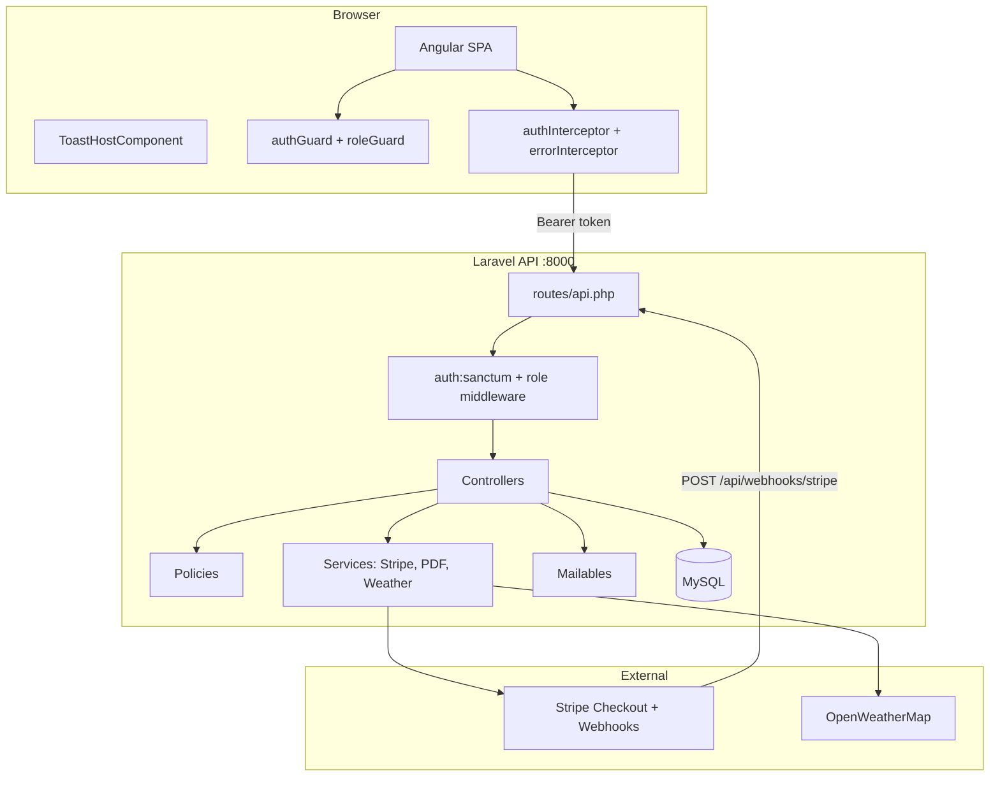
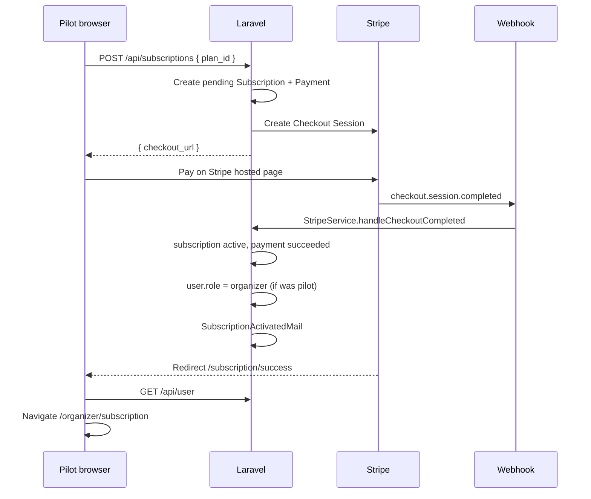

# PitStop Manager — Project guide

This document explains **where everything lives**, **how pieces connect**, and **how the main flows work**. Use it to onboard yourself or as context for an AI assistant completing project documentation or further development.

---

## 1. What this project is

**PitStop Manager** is a web platform for managing **amateur karting championships**:

- **Organizers** create circuits, championships, races, manage inscriptions, and record results (requires an active subscription).
- **Pilots** browse public championships, register for events, and view their results.
- **Admins** manage users, categories, subscription plans, and oversee payments/subscriptions.

| Layer | Technology | Location |
|-------|------------|----------|
| API | Laravel 12, PHP 8.2 | `backend/` |
| SPA | Angular 21 (standalone components) | `frontend/` |
| Database | MySQL / MariaDB | configured in `backend/.env` |
| Auth | Laravel Sanctum (Bearer tokens) | `backend/config/sanctum.php` |
| Payments | Stripe Checkout + webhooks | `backend/app/Services/StripeService.php` |
| PDF receipts | DomPDF | `backend/app/Services/PdfService.php` |
| Weather | OpenWeatherMap | `backend/app/Services/WeatherService.php` |
| Styles | Bootstrap 5 + SCSS design system | `frontend/src/styles.scss` |
| Deploy | Docker + Nginx | `docker/`, `docker-compose.yml` |

**Note:** The folder `reference/Stride365/` is a **separate reference project** (similar stack). Do not confuse it with PitStop Manager. All application code for this product is under `backend/` and `frontend/` only.

---

## 2. How you run it locally

```
Browser  →  http://localhost:4200   (Angular, ng serve)
                │
                │  proxy: /api → http://localhost:8000
                │  proxy: /storage → http://localhost:8000
                ▼
           http://localhost:8000   (Laravel, php artisan serve)
                │
                ▼
           MySQL database pitstop_manager
```

| File | Purpose |
|------|---------|
| `frontend/proxy.conf.json` | Proxies `/api` and `/storage` to Laravel during dev |
| `frontend/src/environments/environment.ts` | `apiUrl: '/api'` (relative, uses proxy) |
| `frontend/src/environments/environment.development.ts` | Same as above (explicit dev file) |
| `backend/.env` | DB, Stripe, mail, `FRONTEND_URL`, `APP_URL` |

Typical commands:

```bash
# Terminal 1 — backend
cd backend && php artisan serve

# Terminal 2 — frontend (restart after angular.json / polyfills changes)
cd frontend && npx ng serve
```

---

## 3. Repository map (top level)

```
PitStopManager/
├── backend/                 # Laravel REST API
├── frontend/                # Angular SPA
├── docker/                  # Nginx + PHP image for production
├── docker-compose.yml
├── README.md                # Setup, users, conventions (short)
├── CHANGES.md               # Chronological audit log of fixes/features
├── PROJECT_GUIDE.md         # ← this file (architecture & navigation)
└── reference/Stride365/     # NOT part of PitStop — template reference only
```

---

## 4. High-level architecture



**Request path (example: list championships):**

1. Component calls `ChampionshipService.getAll()`.
2. `authInterceptor` adds `Authorization: Bearer <token>` if logged in.
3. HTTP `GET /api/championships` → proxy → Laravel.
4. `ChampionshipController@index` → query + `ChampionshipResource` → JSON.
5. Component sets `loading = false`; Zone.js triggers UI update.

---

## 5. Roles and permissions

| Role | DB value | Main UI entry | Backend enforcement |
|------|----------|---------------|---------------------|
| Admin | `admin` | **`http://localhost:8000/admin`** (Laravel Blade, sesión web) | `middleware('admin')` en rutas web; `middleware('role:admin')` en `/api/admin/*` (legacy API) |
| Organizer | `organizer` | `/organizer/*` | `role:organizer` on write routes; subscription quota in `ChampionshipController` |
| Pilot | `pilot` | `/pilot` (dashboard) | `role:pilot` on inscription create; public read for championships |

**How users get each role:**

- **Pilot:** default on `POST /api/register` (`RegisterRequest` forces `role: pilot`).
- **Organizer:** (a) pilot buys subscription → Stripe webhook promotes to `organizer`, or (b) admin edits user in `/admin/users`.
- **Admin:** created via `UserSeeder` only (not self-registration).

---

## 6. Database — entities and relationships

### Tables (migrations in `backend/database/migrations/`)

| Migration | Table | Purpose |
|-----------|-------|---------|
| `0001_01_01_000000_create_users_table` | `users` | Accounts: name, email, password, `role`, `avatar`, `is_active` |
| `2025_05_06_000001_create_pilot_profiles_table` | `pilot_profiles` | Nickname, license, bio (1:1 with pilot users) |
| `2025_05_06_000002_create_subscription_plans_table` | `subscription_plans` | Plans: price, `duration_days`, `max_championships` |
| `2025_05_06_000003_create_subscriptions_table` | `subscriptions` | User ↔ plan, status, dates, Stripe IDs |
| `2025_05_06_000004_create_payments_table` | `payments` | Payment rows linked to subscription |
| `2025_05_06_000005_create_categories_table` | `categories` | Championship categories (e.g. Senior, Junior) |
| `2025_05_06_000006_create_circuits_table` | `circuits` | Tracks: location, lat/lon, image |
| `2025_05_06_000007_create_championships_table` | `championships` | Owned by organizer (`user_id`) |
| `2025_05_06_000008_create_races_table` | `races` | Races inside a championship |
| `2025_05_06_000009_create_inscriptions_table` | `inscriptions` | Pilot registration for a championship |
| `2025_05_06_000010_create_results_table` | `results` | Race results per pilot |

### Eloquent models (`backend/app/Models/`)

| Model | Key relations |
|-------|----------------|
| `User` | `pilotProfile`, `subscriptions`, `championships`, `circuits`, `inscriptions`, `results`, `payments` |
| `Championship` | `user` (organizer), `category`, `races`, `inscriptions` |
| `Race` | `championship`, `circuit`, `results` |
| `Circuit` | `user` (creator), `races` |
| `Inscription` | `user`, `championship` |
| `Result` | `race`, `user` |
| `Subscription` | `user`, `plan`, `payments` |
| `SubscriptionPlan` | — |
| `Payment` | `subscription`, `user` |
| `Category` | `championships` |
| `PilotProfile` | `user` |

### Status enums (must match in backend validation AND frontend labels)

| Entity | Allowed values |
|--------|----------------|
| Inscription | `pending`, `confirmed`, `rejected`, `withdrawn` |
| Championship | `draft`, `published`, `in_progress`, `finished`, `cancelled` |
| Race | `scheduled`, `in_progress`, `completed`, `cancelled` |
| Subscription | `pending`, `active`, `expired`, `cancelled` |
| Payment | `pending`, `succeeded`, `failed`, `refunded` |

### Seeders (`backend/database/seeders/`)

Run order in `DatabaseSeeder.php`:

1. `UserSeeder` — admin, organizers, pilots (+ pilot profiles)
2. `CategorySeeder`
3. `SubscriptionPlanSeeder`
4. `CircuitSeeder`
5. `ChampionshipSeeder`
6. `RaceSeeder`
7. `InscriptionSeeder`
8. `ResultSeeder`
9. `SubscriptionSeeder`

All seeders are **idempotent** (`updateOrCreate`, lookups by email/slug/name — not hardcoded IDs).

**Test passwords:** `password` for all seeded users (see README user table).

---

## 7. Backend — where logic lives

### 7.1 Routing

**Single API file:** `backend/routes/api.php`

- Public: auth (throttled), read-only championships/races/circuits/categories/plans, weather, Stripe webhook.
- `auth:sanctum` group: everything else.
- `role:admin|organizer|pilot` on specific routes.

**Middleware registration:** `backend/bootstrap/app.php` — alias `role` → `RoleMiddleware`.

### 7.2 Controllers (`backend/app/Http/Controllers/`)

| Controller | Responsibility |
|------------|----------------|
| `Auth\AuthController` | register, login, logout, user; sends `WelcomeMail` on register |
| `ProfileController` | user profile + pilot profile + avatar upload |
| `ChampionshipController` | CRUD, status, standings; **subscription quota** on create/publish |
| `CircuitController` | CRUD + image upload |
| `RaceController` | nested under championship |
| `InscriptionController` | list, create (pilot), update status (organizer), destroy/withdraw, my list |
| `ResultController` | CRUD per race, my results |
| `SubscriptionController` | Stripe checkout session, my subscription/payments, PDF download |
| `WeatherController` | proxy to OpenWeatherMap (503 if no API key) |
| `Webhook\StripeWebhookController` | verifies signature → `StripeService::handleWebhookEvent()` |
| `Admin\UserController` | user management |
| `Admin\CategoryController` | categories (public read + admin write) |
| `Admin\SubscriptionPlanController` | plans |
| `Admin\SubscriptionController` | list all subscriptions |
| `Admin\PaymentController` | list all payments |

**Base controller:** `Controller.php` uses `AuthorizesRequests` and `ValidatesRequests` (required for `$this->authorize()`).

### 7.3 Policies (`backend/app/Policies/`)

Laravel policies gate `authorize()` calls:

- `ChampionshipPolicy` — organizer owns championship or admin
- `CircuitPolicy`, `RacePolicy`, `InscriptionPolicy`, `ResultPolicy`

Example: `ResultPolicy::create(User $user, Race $race)` — note it takes `Race`, not `Result`, because the result does not exist yet at creation time.

### 7.4 Form requests (`backend/app/Http/Requests/`)

Validation classes (e.g. `Auth\RegisterRequest`, `Inscription\StoreInscriptionRequest`).  
`RegisterRequest::prepareForValidation()` **forces** `role => pilot` for public registration.

### 7.5 API resources (`backend/app/Http/Resources/`)

Transform models to JSON. Important global setting in `AppServiceProvider`:

```php
JsonResource::withoutWrapping();
```

**Meaning for the frontend:**

| Response type | JSON shape |
|---------------|------------|
| Single resource / non-paginated collection | Raw object or array (no outer `{ data: ... }`) |
| Paginated (`paginate()`) | `{ data: [...], meta, links }` |
| `GET /api/my/subscription` | **Always** `{ data: <subscription\|null> }` (special case) |

### 7.6 Services (`backend/app/Services/`)

| Service | File | Role |
|---------|------|------|
| **Stripe** | `StripeService.php` | Creates pending `Subscription` + `Payment`, Stripe Checkout session with metadata; webhook activates subscription, marks payment succeeded, **promotes pilot → organizer**; sends `SubscriptionActivatedMail` |
| **PDF** | `PdfService.php` | Payment receipt PDF from `resources/views/pdf/payment-receipt.blade.php` |
| **Weather** | `WeatherService.php` | Calls OpenWeatherMap; used by `WeatherController` |

### 7.7 Mail (`backend/app/Mail/` + `resources/views/emails/`)

| Mailable | Trigger | Template |
|----------|---------|----------|
| `WelcomeMail` | After register | `emails/welcome.blade.php` |
| `SubscriptionActivatedMail` | Stripe `checkout.session.completed` | `emails/subscription-activated.blade.php` |
| `InscriptionStatusMail` | Inscription → `confirmed` or `rejected` | `emails/inscription-status.blade.php` |

Shared layout: `emails/layout.blade.php`.  
With `MAIL_MAILER=log`, output goes to `backend/storage/logs/laravel.log`.

---

## 8. Critical backend flows

### 8.1 Authentication (Sanctum)

```
POST /api/register  →  User + PilotProfile  →  token  →  frontend stores in localStorage
POST /api/login     →  token
GET  /api/user      →  refresh current user (used after Stripe success)
POST /api/logout    →  revokes current token
```

Frontend storage (`auth.service.ts`):

- `localStorage.token`
- `localStorage.user` (JSON)
- `currentUser$` BehaviorSubject

### 8.2 Pilot → Organizer (subscription)



**Files involved:**

| Step | Location |
|------|----------|
| Subscribe button (pilot) | `frontend/.../pilot/upgrade/pilot-upgrade.component.ts` |
| Subscribe button (organizer renew) | `frontend/.../organizer/subscription/subscription-page.component.ts` |
| API call | `frontend/.../core/services/subscription.service.ts` → `subscribe()` |
| Create session | `SubscriptionController@store` → `StripeService::createCheckoutForSubscription` |
| Webhook | `StripeWebhookController` → `StripeService::handleWebhookEvent` |
| Success UI | `frontend/.../subscription-result/subscription-result.component.ts` |

Stripe redirect URLs (from `StripeService`):

- Success: `{FRONTEND_URL}/subscription/success?session_id={CHECKOUT_SESSION_ID}`
- Cancel: `{FRONTEND_URL}/subscription/cancel`

### 8.3 Championship lifecycle (organizer)

1. Organizer must have **active subscription** (`ChampionshipController` checks).
2. Create championship → status typically `draft`.
3. `PATCH /api/championships/{id}/status` → `published` (opens inscriptions), later `in_progress`, `finished`, etc.
4. Quota: active championships count vs `plan.max_championships`.

### 8.4 Inscriptions

| Action | Who | Endpoint | Effect |
|--------|-----|----------|--------|
| Register | Pilot | `POST .../inscriptions` | `status: pending` |
| Approve / reject | Organizer | `PATCH /inscriptions/{id}/status` | Email on confirm/reject |
| Withdraw | Pilot | `DELETE /inscriptions/{id}` | `status: withdrawn` (soft) |
| Hard delete | Admin | `DELETE /inscriptions/{id}` | row removed (204) |

Frontend pilot list: `pilot-inscription-list.component.ts` uses `inscriptionService.withdraw()`.

### 8.5 Results and standings

- Results: `POST /api/races/{race}/results` (organizer); pilot must have **confirmed** inscription.
- Standings: `GET /api/championships/{id}/standings` — aggregated points.
- Public UI: `championship-detail.component.ts` tabs **Carreras** / **Clasificación**.

---

## 9. Frontend — structure and behavior

### 9.1 Entry and bootstrap

| File | Role |
|------|------|
| `frontend/src/main.ts` | Bootstraps Angular app |
| `frontend/src/app/app.config.ts` | Router, HTTP, Zone.js (`provideZoneChangeDetection`), interceptors |
| `frontend/src/app/app.routes.ts` | **All routes** (lazy-loaded standalone components) |
| `frontend/src/app/app.html` | `<router-outlet />` + `<app-toast-host />` |
| `frontend/src/styles.scss` | Global design system (Bootstrap overrides, utilities) |
| `frontend/angular.json` | Build config; **`polyfills: ["zone.js"]`** required for Angular 21 |

**Zone.js:** Without `zone.js` + `provideZoneChangeDetection`, HTTP callbacks do not trigger change detection → spinners stay forever. Restart `ng serve` after changing `angular.json`.

### 9.2 Layouts (`frontend/src/app/layouts/`)

| Layout | Used for | File |
|--------|----------|------|
| `MainLayoutComponent` | Public, auth, pilot, organizer | `main-layout/` — navbar, footer, user dropdown |
| *(removed)* | `/admin` in SPA | Redirects to Laravel `environment.adminUrl` (`admin-redirect/`) |

**Laravel Blade admin** (`backend/resources/views/admin/`, `routes/admin.php`, `app/Http/Controllers/Admin/Web/`):

| URL | Purpose |
|-----|---------|
| `/admin/login` | Session login (web guard) |
| `/admin` | Dashboard KPIs |
| `/admin/users`, `/categories`, `/plans` | CRUD / toggle active |
| `/admin/subscriptions`, `/payments` | Read-only oversight |
| `/admin/championships` | Full CRUD + status + nested races/inscriptions |
| `/admin/circuits` | Full CRUD + image upload |
| `/admin/races/{race}/results` | Result entry per race |

### 9.3 Core (`frontend/src/app/core/`)

**Guards**

| Guard | File | Behavior |
|-------|------|----------|
| `authGuard` | `guards/auth.guard.ts` | Requires token → else `/login` |
| `roleGuard` | `guards/role.guard.ts` | Checks `route.data.roles` vs `user.role`; wrong role → redirect to that role's home |

**Interceptors**

| Interceptor | File | Behavior |
|-------------|------|----------|
| `authInterceptor` | `interceptors/auth.interceptor.ts` | Adds `Authorization: Bearer`, `Accept: application/json` |
| `errorInterceptor` | `interceptors/error.interceptor.ts` | Sets `err.displayMessage`; 401 → logout + `/login`; toasts for 0/403/5xx |

**Services** (`core/services/`) — one per API domain:

| Service | Backend prefix |
|---------|----------------|
| `auth.service.ts` | `/api/login`, `/register`, `/logout`, `/user` |
| `championship.service.ts` | `/api/championships` |
| `circuit.service.ts` | `/api/circuits` |
| `race.service.ts` | `/api/races`, `/api/championships/{id}/races` |
| `inscription.service.ts` | `/api/inscriptions`, `/api/my/inscriptions` |
| `result.service.ts` | `/api/results`, `/api/my/results` |
| `subscription.service.ts` | `/api/subscriptions`, `/api/my/subscription`, plans, payments |
| `category.service.ts` | `/api/categories` |
| `user.service.ts` | `/api/admin/users` |
| `weather.service.ts` | `/api/weather` |
| `notification.service.ts` | **Client-only** toasts (no API) |
| `storage.service.ts` | Helper for file URLs if needed |

**Models** (`core/models/`) — TypeScript interfaces matching API shapes.

### 9.4 Features (`frontend/src/app/features/`)

Organized by **role / area**. Each feature is typically a folder with:

- `*.component.ts` — standalone component
- `*.component.html` — template
- `*.component.scss` — styles

| Folder | Routes (see `app.routes.ts`) | Purpose |
|--------|------------------------------|---------|
| `public/landing` | `/` | Marketing home |
| `public/championship-list` | `/championships` | Public catalog |
| `public/championship-detail` | `/championships/:id` | Races, standings, weather |
| `auth/login`, `auth/register` | `/login`, `/register` | Auth forms |
| `pilot/dashboard` | `/pilot` | Pilot home + upgrade CTA |
| `pilot/upgrade` | `/pilot/upgrade` | Plan cards → Stripe |
| `pilot/profile` | `/pilot/profile` | Pilot profile |
| `pilot/championships` | `/pilot/championships` | Browse + inscribe |
| `pilot/inscriptions` | `/pilot/inscriptions` | My registrations |
| `pilot/results` | `/pilot/results` | My race results |
| `organizer/championships/*` | `/organizer/championships/...` | CRUD, races, inscriptions |
| `organizer/circuits/*` | `/organizer/circuits/...` | Circuit CRUD |
| `organizer/races/*` | nested under championships | Race forms |
| `organizer/results/*` | `/organizer/races/:raceId/results/...` | Result entry |
| `organizer/subscription` | `/organizer/subscription` | Active plan, payments, renew |
| `subscription-result` | `/subscription/success`, `/cancel` | Post-Stripe pages |
| `admin/admin-redirect` | `/admin` (SPA) | Redirect to Laravel panel |
| *(deprecated Angular admin modules still in repo but unused)* | | |

### 9.5 Shared (`frontend/src/app/shared/`)

| Component | Role |
|-----------|------|
| `toast-host/` | Renders global toast stack; driven by `NotificationService` |

---

## 10. Frontend routes cheat sheet

| URL | Auth | Role | Component area |
|-----|------|------|----------------|
| `/` | No | — | Landing |
| `/login`, `/register` | No | — | Auth |
| `/championships`, `/championships/:id` | No | — | Public |
| `/subscription/success`, `/cancel` | Yes | any | Subscription result |
| `/pilot` | Yes | pilot | Dashboard |
| `/pilot/upgrade` | Yes | pilot | Upgrade plans |
| `/pilot/profile`, `/inscriptions`, `/results`, `/championships` | Yes | pilot | Pilot features |
| `/organizer/championships`, `/circuits`, `/subscription`, … | Yes | organizer | Organizer features |
| `/admin` (SPA) | Yes | admin | Redirect → `http://localhost:8000/admin` |
| `http://localhost:8000/admin/*` | Session (web) | admin | **Laravel Blade** — full system config |

Organizer still has legacy routes `/organizer/subscription/success|cancel` pointing at the same subscription page component; Stripe now redirects to the **global** `/subscription/*` routes.

---

## 11. Configuration reference (`backend/.env`)

| Variable | Used for |
|----------|----------|
| `DB_*` | MySQL connection |
| `APP_URL` | Laravel URL (e.g. `http://localhost:8000`) |
| `FRONTEND_URL` | Stripe return URLs (e.g. `http://localhost:4200`) |
| `STRIPE_KEY`, `STRIPE_SECRET`, `STRIPE_WEBHOOK_SECRET` | Payments |
| `OPENWEATHERMAP_API_KEY` | Weather endpoint |
| `MAIL_*` | Transactional email (`log` driver = log file only) |
| `FILESYSTEM_DISK` | Local storage for avatars/circuit images (`storage/app/public`) |

Run `php artisan storage:link` so `/storage/...` URLs work for uploaded images.

---

## 12. UI / design system

Global styles: `frontend/src/styles.scss`

- CSS variables: `--ps-primary`, `--ps-surface`, `--ps-shadow`, etc.
- Utilities: `.status-pill`, `.empty-state`, `.skeleton`, `.page-header`, `.table-wrap`, `.avatar`
- Bootstrap 5 + **bootstrap-icons** (bundled in styles)

Component-specific SCSS lives next to each component. Landing page has the richest custom styling (`features/public/landing/landing.component.scss`).

---

## 13. Error handling conventions

### Backend HTTP codes

| Code | Typical cause |
|------|----------------|
| 401 | No/invalid token (`RoleMiddleware` or Sanctum) |
| 403 | Wrong role or business rule (no subscription, quota exceeded) |
| 422 | Validation failed (`errors` object per field) |
| 503 | Stripe or weather not configured |

### Frontend

- Components should read `err.displayMessage` from failed HTTP calls (set by `errorInterceptor`).
- Login/register keep **inline** errors (interceptor skips toast for those URLs).
- Global toasts for network/server/forbidden errors.

---

## 14. Where to change common things

| I want to… | Go to |
|------------|-------|
| Add API endpoint | `backend/routes/api.php` + new controller method |
| Change validation rules | `backend/app/Http/Requests/...` |
| Change who can do an action | `backend/app/Policies/...` + controller `$this->authorize()` |
| Change JSON output shape | `backend/app/Http/Resources/...` |
| Change subscription / Stripe logic | `backend/app/Services/StripeService.php` |
| Change email content | `backend/resources/views/emails/` + `app/Mail/` |
| Add a new page | Component under `features/`, route in `app.routes.ts`, optional nav link in layout |
| Add API call from UI | `core/services/*.service.ts` + component subscribe |
| Change nav menu | `main-layout.component.html` or `admin-layout.component.html` |
| Change colors / global UI | `frontend/src/styles.scss` |
| Add test data | `backend/database/seeders/` |
| Fix spinner stuck on lists | Ensure `zone.js` in `package.json`, `angular.json` polyfills, `provideZoneChangeDetection` in `app.config.ts`, restart `ng serve` |

---

## 15. Related documentation files

| File | Contents |
|------|----------|
| `README.md` | Install steps, test users, feature checklist, enum conventions |
| `CHANGES.md` | Detailed history of bugfixes and feature passes (audit trail) |
| `PROJECT_GUIDE.md` | This guide — structure, flows, file map |

---

## 16. Quick test accounts

| Email | Password | Role |
|-------|----------|------|
| admin@pitstop.com | password | admin |
| carlos@pitstop.com | password | organizer |
| maria@pitstop.com | password | organizer |
| piloto1@pitstop.com … piloto5@pitstop.com | password | pilot |

---

## 17. AI context snippet (paste into “project memory”)

> **PitStop Manager** is a Laravel 12 API (`backend/`) + Angular 21 SPA (`frontend/`) for karting championship management. Auth: Sanctum bearer tokens in `localStorage`, guards `authGuard`/`roleGuard`, interceptors attach token and expose `displayMessage` on errors. Roles: `admin`, `organizer`, `pilot` (register always creates pilot). Organizers need active `subscriptions` row; pilots upgrade via `/pilot/upgrade` → Stripe Checkout → webhook in `StripeService` activates subscription and sets `user.role = organizer`. JSON: `JsonResource::withoutWrapping()` except paginated lists and `{data}` wrapper on `GET /my/subscription`. Key enums: inscription `confirmed` not `accepted`, championship finished not `completed`. Frontend proxy `/api` → `:8000`. Zone.js required for change detection. Routes in `frontend/src/app/app.routes.ts`, API in `backend/routes/api.php`. Do not edit `reference/Stride365/` — it is a separate template project.

---

*Last updated: reflects fourth-pass UI + pilot upgrade + emails + toasts. For line-level change history see `CHANGES.md`.*
